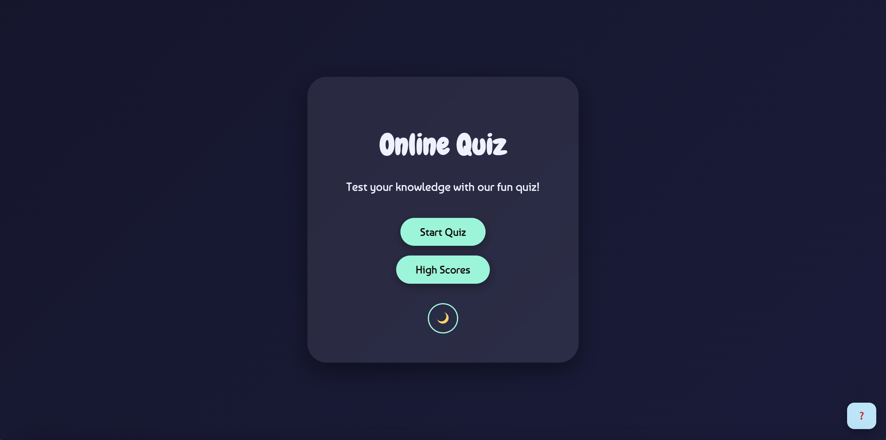

# 🎯 Online Quiz  

## 📌 Overview  
Welcome to **Online Quiz** — an interactive, fun quiz app built with **HTML**, **CSS**, and **JavaScript**.  
Play, score, and challenge yourself with randomised questions, track your progress, and view your high scores — all in a clean, responsive UI. 
The quiz includes multiple categories including General Knowledge, Science, Sports, Movies, and more, ensuring every game is fresh and challenging.

**🔗 Live Demo:** [Click Here](https://hamilton2025.github.io/project-online-quiz/)  

---

## ✨ Features  

- ✅ **Dynamic Questions** – Randomised questions for every play  
- ✅ **Diverse Question Topics**

  * Questions are drawn randomly from multiple topics, making each quiz unique and unpredictable.
- ✅ **Multiple Pages** – Home, Quiz, End, High Scores  
- ✅ **Light/Dark Mode** – Switch themes with one click (saves your preference)  
- ✅ **Rules Popup** – Clear instructions before you start or during the quiz.
- ✅ **Real-Time Progress** – Question number, progress bar, and instant score  
- ✅ **Confetti Celebration 🎉** – Fun animation at the end of the quiz  
- ✅ **High Score System** – Save your name & score, view Top 5, and clear scores  
- ✅ **Responsive Design** – Works perfectly on desktop, tablet, and mobile  

---

## 🛠️ Tech Stack  

- **HTML5** – Semantic structure  
- **CSS3** – Styling, responsiveness, light/dark theme  
- **JavaScript (Vanilla)** – Logic, local storage for theme & scores  
- **Google Fonts** – Custom typography  
- **Font Awesome** – Icons  
- **VSCode** – Code editor
- **Git & GitHub** – Version control and hosting

---

## 📂 Pages & Flow  

1. **Home Page**  
   - Start Quiz button  
   - High Scores link  
   - Theme toggle (Light/Dark)  

2. **Quiz Page**  
   - Randomised questions  
   - Progress bar & live score  
   - Rules popup  

3. **End Page**  
   - Final score display  
   - Save score with username  
   - Replay or return home  

4. **High Scores Page**  
   - Displays top 5 scores  
   - Option to clear scores  

---

## 📋 Testing

✔ **Cross-Browser Testing** – Verified on Chrome & Firefox  
✔ **Responsive Layout** – Verified using Chrome Responsive Viewer extension  
✔ **Functional Checks**:
   - ✅ Question randomisation  
   - ✅ Score calculation  
   - ✅ Progress bar updates  
   - ✅ Theme persistence  
   - ✅ High score system works

✔ **Validation** – Passed W3C HTML & CSS checks  
✔ **Lighthouse Audit** – Performance, Accessibility, SEO passed  

---

## 🖼️ Screenshots  

---

## 🚀 Deployment  

- Deployed on **GitHub Pages**  
- **Steps:**  
  1. Go to **Settings > Pages**  
  2. Select **Main Branch**  
  3. Save and copy live link  
- **Live Link:** [Online Quiz](https://hamilton2025.github.io/project-online-quiz/)  

---

## 🔮 Future Enhancements  

- ⏳ Timer-based challenge mode  
- 🏆 Difficulty levels  
- 🔊 Sound effects for answers  

---

## 📬 Contact  

📧 **Email:** hamilton.fernandosh@gmail.com  

💻 **GitHub Repo:** [Click Here](https://github.com/Hamilton2025/project-online-quiz)  
